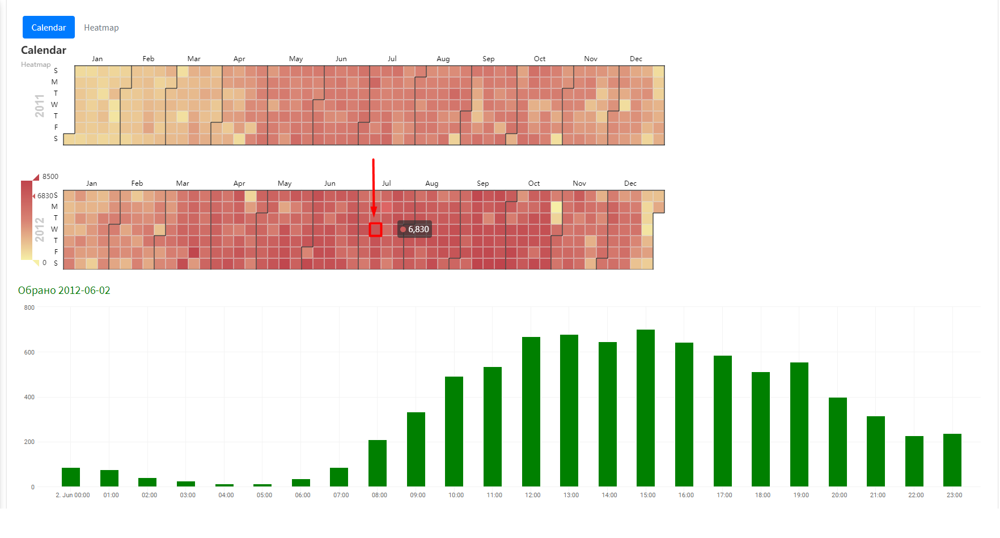
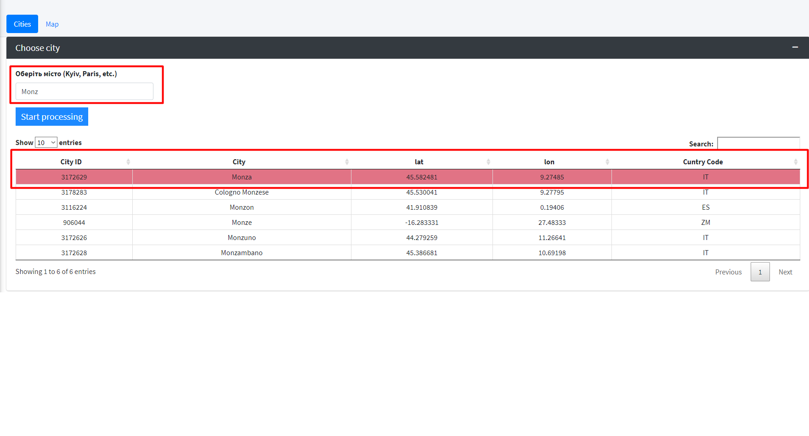
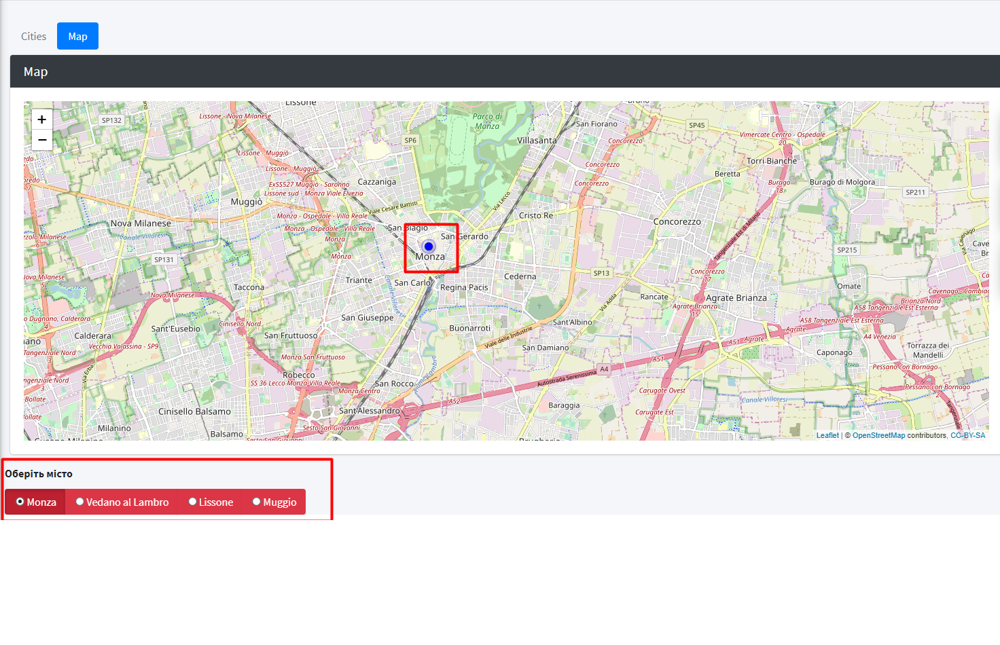

# Тестове завдання
### Витрачений час :
  1. Звіт ~ 5h
  2. ShinyApp ~ 11h

 Звіт знаходиться `output.html` 
 Було проведено EDA для пошуку аномалій, побудовано `boxplots` та проаналізовано часові ряди 
 Виявлені аномалії замінені за допомогою `knnImpute` з пакету `recipes` 
 Побудовано модель за допомгою `randomForest` та `xgboost`. Розглянуто вплив змінних 
 Обрано кращий алгоритм та підбір оптимальних параметрів, побудовано різні моделі для найвпливовішого фактору `workingday` 

<h3>[Shiny App](https://jyjek.shinyapps.io/ambulance_call)</h3>
Оптимальні налаштування 80% zoom у браузері. 
На вкладці `Motorbike issues` :

  1. Aналіз початкового вхідного датафрейму з тепловою картою викликів протягом тижня у розрізі
дня тижню та години.

  2. Аналіз щогодинної кількості дзвінків для конкретної дати, яку необхідно обрати натиснувши на дату в календарі
    
  
Вкладка `Prediction by town` - прогнозована кількість дзвінків для обраного міста. 
Всі дані отримуються через АРІ [openweathermap.org](https://openweathermap.org)

  Способи обрати місто :
  
  1. ВВести паттерн назви на вкладці `Cities` та у таблиці нижче обрати потрібне місто
  
  2. Натиснути точку на карті та за допогою `radioButtons` обрати місто
  
 